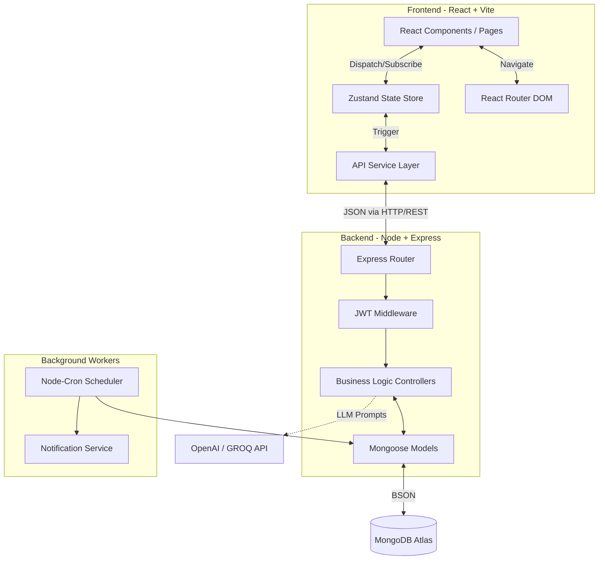

<div align="center">

# 🚀 InternPulse: The Ultimate Smart Internship Progress Tracker
### A Next-Generation, AI-Powered, MERN Stack Platform

[](https://reactjs.org/)
[](https://vitejs.dev/)
[](https://www.typescriptlang.org/)
[](https://nodejs.org/)
[](https://www.mongodb.com/)
[](https://tailwindcss.com/)
[](https://zustand-demo.pmnd.rs/)
[](https://openai.com/)

A professional, hackathon-grade enterprise application designed to completely revolutionize how organizations manage, track, and evaluate internships. Built with an extreme focus on user experience, data integrity, and automation.

</div>

---

## 📖 Table of Contents
1. [Executive Summary](#-executive-summary)
2. [Deep-Dive Feature Matrix](#-deep-dive-feature-matrix)
3. [Architecture & Data Flow](#-architecture--data-flow)
4. [Role-Based Workflows (30+ Screens)](#-role-based-workflows-30-screens)
5. [AI Integration & Automated Scoring](#-ai-integration--automated-scoring)
6. [Advanced CRON Automation](#-advanced-cron-automation)
7. [Database Schema Design](#-database-schema-design)
8. [Comprehensive Tech Stack Analysis](#-comprehensive-tech-stack-analysis)
9. [REST API Reference Guide](#-rest-api-reference-guide)
10. [Local Development Setup](#-local-development-setup)
11. [Production Deployment Guide](#-production-deployment-guide)
12. [Security & Authentication](#-security--authentication)
13. [Troubleshooting & FAQ](#-troubleshooting--faq)
14. [Future Roadmap](#-future-roadmap)

---

## 🌟 Executive Summary

**InternPulse** eliminates the friction of traditional internship programs. By replacing scattered spreadsheets, delayed emails, and manual tracking with a unified, automated dashboard, it ensures that interns receive timely feedback and managers can effortlessly monitor team health.

The platform boasts **over 30 meticulously crafted UI screens**, sophisticated real-time analytics, background CRON jobs for proactive notifications, and state-of-the-art **Generative AI** integration to automatically summarize lengthy reports and extract key blockers.

---

## 🔥 Deep-Dive Feature Matrix

### 🧠 AI & Machine Learning
- **Report Summarization:** Utilizing OpenAI's GPT-4o-mini (via GROQ), the system reads through lengthy intern submissions and extracts a bulleted summary of accomplishments, blockers, and next steps.
- **Sentiment & Effort Scoring:** The AI algorithm provides a baseline "Certificate Score" (0-100) based on the thoroughness, technical depth, and completion status of the reported tasks.

### 📈 Analytics & Data Visualization
- **Dynamic Leaderboards:** A gamified experience that ranks interns based on calculated scores `(approvedReports * 10) + (completedGoals * 20)`.
- **Activity Heatmaps:** A GitHub-style contribution graph visually representing the frequency of report submissions over the last 6 months.
- **Manager Insights:** Real-time calculation of Team Success Rates, Pending vs. Completed metrics, and cohort-wide trajectory charts using **Recharts**.

### 🛠 Visual Project Management
- **Kanban Boards:** Drag-and-drop task interfaces for moving goals from `Pending` -> `In-Progress` -> `Submitted`.
- **Interactive Calendars:** Deadlines are automatically plotted on a master calendar view, allowing visual time management.

---

## 🏛 Architecture & Data Flow

InternPulse employs a deeply decoupled Client-Server architecture, connected via a RESTful API and secured by HTTP Bearer Tokens.



---

## 👥 Role-Based Workflows (30+ Screens)

The platform dynamically adjusts its UI and capabilities based on the authenticated user's role.

### 🧑‍🎓 1. Intern Experience
**Focus:** Task execution, reporting, and personal growth.
- **Intern Dashboard:** A centralized hub showing active tasks, success rate `(Completed / Assigned * 100)`, and recent notifications.
- **Goals List View:** Detailed breakdown of assigned objectives.
- **Report Submission Engine:** A rich-text editor (React-Quill) to submit weekly accomplishments.
- **Feedback & Revisions:** A dedicated screen to view manager feedback, AI summaries, and revise rejected reports.
- **Personal Analytics:** View individual progression charts and the overall leaderboard.

### 👩‍💼 2. Manager Experience
**Focus:** Oversight, goal setting, and evaluation.
- **Manager Dashboard:** High-level metrics showing `Total Interns`, `Active Goals`, `Pending Reviews`, and `Completed Goals`.
- **Team Directory:** Searchable, filterable list of all assigned interns and their current status.
- **Goal Creator:** Interface to draft goals, set deadlines, assign point values, and distribute them to specific interns.
- **Review Queue:** A streamlined interface to rapidly approve reports, request revisions, and append constructive feedback.
- **Team Analytics:** Aggregate metrics showing the health of the entire cohort.

### 🛡️ 3. Administrator Experience
**Focus:** System health, cohort management, and global oversight.
- **Global Dashboard:** Bird's eye view of all managers and interns across the entire company.
- **Cohort Creation:** Interface to build new internship batches and assign managers.
- **System Logs:** Real-time view of all system-generated notifications and CRON job executions.
- **User Management:** Full CRUD capabilities for platform accounts.

---

## 🤖 AI Integration & Automated Scoring

When an intern submits a report, the manager has the option to trigger the AI Summarization Engine. 

1. **Extraction:** The backend strips HTML tags from the rich-text report.
2. **Prompting:** The text is sent to the LLM with a strict system prompt to extract exactly 3 things: `Highlights`, `Blockers`, and `Next Week's Plan`.
3. **Scoring:** The system analyzes keyword density and milestone completion to suggest a numeric score (0-100).
4. **Storage:** The summary is saved directly into the MongoDB document for rapid retrieval, preventing redundant API calls.

---

## ⏰ Advanced CRON Automation

InternPulse includes a robust background worker system built with `node-cron` to eliminate manual follow-ups.

| Event | Schedule | Audience | Action / Message |
|-------|----------|----------|------------------|
| **Weekly Reminder** | Friday @ 5:00 PM | Interns | "Friendly reminder: Please submit your weekly reports for active goals." |
| **Manager Briefing**| Monday @ 9:00 AM | Managers | "You have X reports waiting in your review queue." |
| **Overdue Alerts** | Every Hour | Interns | Scans for goals past deadline and issues an immediate urgent alert. |
| **Midweek Nudge** | Wednesday @ 12:00 PM | Interns | Detects goals stuck in "Pending" and nudges users to begin work. |
| **Weekly Digest** | Sunday @ 8:00 PM | Managers | Compiles a summary of team performance over the past 7 days. |

---

## 🗄️ Database Schema Design

The NoSQL schema is optimized for heavy read operations and complex document population.

### `User` Collection
Stores authentication details, roles (`intern`, `manager`, `admin`), profile data, and calculated stats.
### `Goal` Collection
Tracks objectives. Fields include `title`, `description`, `assignedTo` (Array of Refs), `createdBy` (Ref), `status` (Pending, In-Progress, Submitted, Approved), `deadline`, and `points`.
### `Report` Collection
Links Interns to Goals. Fields include `content`, `aiSummary`, `status`, `score`, `managerFeedback`, and timestamp logs (`submittedAt`, `reviewedAt`).
### `Notification` Collection
Stores system alerts. Fields include `recipient`, `type` (goal_assigned, report_approved, reminder), `message`, and `isRead` boolean.

---

## 💻 Comprehensive Tech Stack Analysis

### Why This Stack?
- **React 18 + Vite:** Chosen for lightning-fast HMR (Hot Module Replacement) and optimized production builds. Vite outperforms Webpack significantly in dev-server boot times.
- **TypeScript:** Enforces strict typing across the entire frontend, drastically reducing runtime errors and improving IDE autocomplete.
- **Zustand:** A lightweight, unopinionated state manager. Selected over Redux to avoid boilerplate while maintaining predictable global state for Auth and UI toggles.
- **Tailwind CSS + Radix UI:** Tailwind allows rapid utility-first styling without context switching. Radix provides unstyled, accessible UI primitives (Dialogs, Tooltips, Selects) ensuring WCAG compliance.
- **Node.js + Express:** A non-blocking, event-driven architecture perfect for handling thousands of concurrent REST requests and background CRON jobs.
- **MongoDB + Mongoose:** A flexible NoSQL document structure that perfectly maps to JSON, allowing rapid iteration of the data schema during the hackathon.

---

## 🔌 REST API Reference Guide

Base URL: `http://localhost:5000/api`

### Auth API
| Method | Endpoint | Description | Auth Required |
|---|---|---|---|
| POST | `/auth/login` | Authenticate and receive JWT | No |
| GET | `/auth/me` | Fetch authenticated user profile | Yes |
| PUT | `/auth/onboard` | Complete initial profile setup | Yes |

### Goals API
| Method | Endpoint | Description | Auth Required |
|---|---|---|---|
| GET | `/goals` | Get all goals for user (assigned or created) | Yes |
| GET | `/goals/:id` | Get specific goal details | Yes |
| POST | `/goals` | Create new goal | Yes (Manager/Admin) |
| PATCH | `/goals/:id/status`| Update goal status | Yes |
| DELETE | `/goals/:id` | Delete a goal | Yes (Manager/Admin) |

### Reports API
| Method | Endpoint | Description | Auth Required |
|---|---|---|---|
| POST | `/reports` | Submit a report for a goal | Yes (Intern) |
| GET | `/reports/mine` | View user's submission history | Yes (Intern) |
| GET | `/reports/queue` | View pending reports for team | Yes (Manager) |
| PATCH | `/reports/:id/review`| Approve/Reject report with score | Yes (Manager) |
| POST | `/reports/:id/summarize`| Trigger LLM summary generation | Yes (Manager) |

---

## 🖥️ Local Development Setup

### 1. Prerequisites Installation
Ensure you have the following installed on your machine:
- [Node.js](https://nodejs.org/) (v18.x or higher)
- [MongoDB Community Server](https://www.mongodb.com/try/download/community) (running on port 27017)
- [Git](https://git-scm.com/)

### 2. Repository Cloning
```bash
git clone https://github.com/Isaiaarasan/Carrier-Hackathon.git
cd Carrier-Hackathon
```

### 3. Server Initialization (Backend)
```bash
# Navigate to the backend directory
cd Server

# Install all Node modules
npm install

# Create the environment configuration file
copy .env.example .env  # On Windows
cp .env.example .env    # On Mac/Linux
```

**Populate `Server/.env`:**
```env
PORT=5000
NODE_ENV=development
FRONTEND_URL=http://localhost:5173
DB_URL=mongodb://127.0.0.1:27017/internpulse
JWT_SECRET=generate_a_random_secure_string_here
GROQ_API_KEY=your_groq_or_openai_api_key
```

**Run the Server:**
```bash
# Starts the server with Nodemon for auto-reloading
npm run dev
```
*(You should see: `✅ Database connected` and `✅ All CRON jobs initialized` in the terminal)*

### 4. Client Initialization (Frontend)
Open a completely new terminal window/tab.

```bash
# Navigate to the frontend directory
cd Client

# Install dependencies (use legacy-peer-deps if using newer npm versions)
npm install --legacy-peer-deps

# Create environment configuration
echo "VITE_API_URL=http://localhost:5000/api" > .env
```

**Run the Client:**
```bash
npm run dev
```
*(Navigate to `http://localhost:5173` in your browser. The application is now live locally.)*

---

## 🚀 Production Deployment Guide

To deploy InternPulse to the public internet, follow this highly recommended stack:

### 1. Database (MongoDB Atlas)
- Create a free cluster on [MongoDB Atlas](https://www.mongodb.com/cloud/atlas).
- Whitelist all IPs (`0.0.0.0/0`) or specific server IPs.
- Obtain the connection string and replace `DB_URL` in your backend environment.

### 2. Backend Hosting (Render or Railway)
- Connect your GitHub repository to Render/Railway.
- Set the root directory to `Server`.
- Set the Build Command: `npm install`
- Set the Start Command: `npm start`
- Inject all Environment Variables from the `.env` file via the hosting dashboard.

### 3. Frontend Hosting (Vercel or Netlify)
- Connect your GitHub repository to Vercel/Netlify.
- Set the Root Directory to `Client`.
- Framework Preset: `Vite`
- Build Command: `npm run build`
- Output Directory: `dist`
- Add the Environment Variable `VITE_API_URL` pointing to your deployed backend URL (e.g., `https://internpulse-api.onrender.com/api`).

---

## 🔐 Security & Authentication

Data protection is prioritized at every layer of InternPulse:
1. **Password Hashing:** Passwords are never stored in plaintext. They are salted and hashed using `bcryptjs` with a cost factor of 10.
2. **JWT Authorization:** Stateless authentication via JSON Web Tokens. Tokens expire securely and are required in the `Authorization: Bearer <token>` header of every protected request.
3. **HTTP Security Headers:** `helmet` is utilized to secure Express apps by setting various HTTP headers (XSS filtering, HSTS, NoSniff).
4. **CORS Protection:** Cross-Origin Resource Sharing is strictly configured to only accept requests from the verified frontend domain.
5. **Role-Based Middleware:** API endpoints are protected by role checks. An intern attempting to access `/api/users/analytics` will receive an automatic `403 Forbidden` response.

---

## 🛠️ Troubleshooting & FAQ

**Q: Why am I getting CORS errors on login?**
A: Ensure the `FRONTEND_URL` in the Server `.env` exactly matches your Vite development URL, and ensure the `VITE_API_URL` in the Client exactly matches the backend port.

**Q: The AI Summarization isn't working.**
A: Verify that your `GROQ_API_KEY` is valid and has not exceeded its rate limits. Check the Server console for detailed Axios error logs.

**Q: Why aren't CRON job notifications appearing?**
A: Notifications are generated based on the server's local time. Ensure your server timezone is correct. Notifications are deduped to prevent spam, so a job will only notify a user once per condition per day.

---

## 🌌 Future Roadmap

We are continuously iterating on InternPulse. Upcoming features include:
- [ ] **React Native Companion App:** Native iOS and Android applications for push notifications and on-the-go report submissions.
- [ ] **WebSocket Integration (Socket.io):** Transitioning notifications from polling to real-time, bi-directional socket streams.
- [ ] **Advanced Data Export:** Implementing `pdfkit` and `csv-writer` to allow Admins to generate compliance reports for university stakeholders.
- [ ] **Multi-Tenant Architecture:** Allowing multiple distinct companies to utilize the platform in isolated environments.

---

<div align="center">
  
  <br>
  <i>Conceptualized, Architected, and Developed during the <strong>Carrier Hackathon</strong>.</i>
</div>
